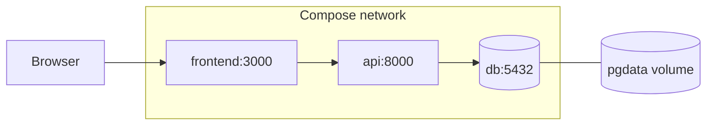

# Local stack

Browser reaches the frontend on :3000; frontend, api, and db talk over the Compose network, and db persists data in the pgdata volume.

```mermaid
flowchart LR
    A[Browser] --> B[frontend:3000]
     subgraph Compose network
    B --> C[api:8000]
    C --> D[(db:5432)]
    end
    D --- E[(pgdata volume)]
```